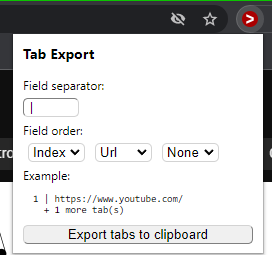
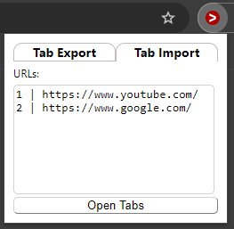
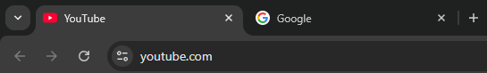

# TabExport Chrome Extension
A Chrome extension that exports open tabs to, and opens tabs from, the clipboard.

Install it from the Chrome Web Store: [TabExport](https://chrome.google.com/webstore/detail/tab-export/pmobcjipmoagglmocflbmccliajolcde)

## Examples

### Exporting


On your clipboard:
```
1 | https://www.youtube.com/
2 | https://www.google.com/
```

### Importing


