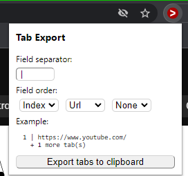

# TabExport Chrome Extension
A Chrome extension that exports open tabs to the clipboard.

Install it from the Chrome Web Store: [TabExport](https://chrome.google.com/webstore/detail/tab-export/pmobcjipmoagglmocflbmccliajolcde)

## Example

### Input
    
### Output
```
1 | https://www.youtube.com/
2 | https://www.google.com/
```

